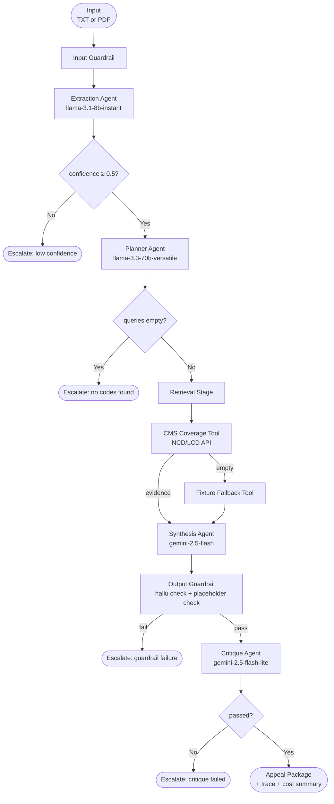
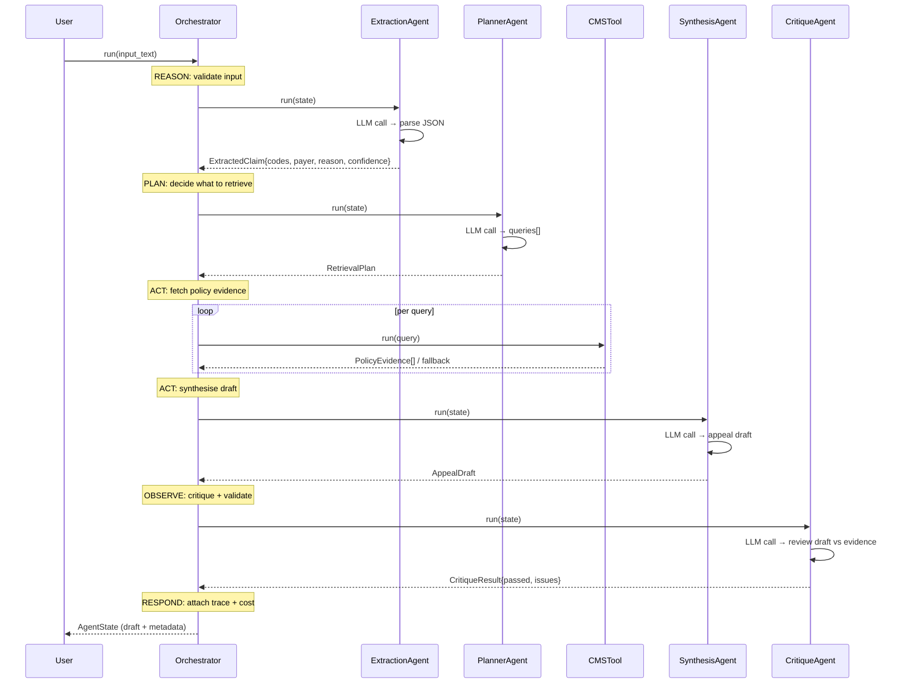

# Architecture & Agent Run Report

This document covers the system architecture, agent loop design, sample run trace, evaluation results, and key design decisions for the Claims Denial & Appeal Intelligence Agent.

---

## 1. System Overview

**Goal:** Given a claims denial letter or EOB document, produce a structured, evidence-backed appeal preparation package that a human can review and act on.

**Agent type:** Custom linear multi-stage pipeline with LLM-driven agents, tool calls, structured output parsing, self-critique, and guardrails.

**Stack:**
- Python 3.10+
- Groq (Llama 3.1 8B, Llama 3.3 70B) + Google AI Studio (Gemini 2.5 Flash / Lite)
- FastAPI web UI, pypdf for document parsing
- CMS Coverage API for grounded NCD/LCD policy retrieval

---

## 2. Architecture Diagrams

### 2a. Pipeline Flowchart



### 2b. Agent Loop (Reason → Plan → Act → Observe → Respond)



### 2c. Component Map

```
src/agent/
│
├── core/
│   ├── orchestrator.py    ← pipeline conductor, manages state and spans
│   ├── router.py          ← selects LLM provider per role, handles fallbacks
│   └── state.py           ← AgentState dataclass (shared across all stages)
│
├── agents/
│   ├── base.py            ← BaseAgent: call_llm(), parse_json(), cache logic
│   ├── extraction.py      ← reads denial letter → ExtractedClaim
│   ├── planner.py         ← ExtractedClaim → RetrievalPlan
│   ├── synthesis.py       ← claim + evidence → AppealDraft
│   └── critique.py        ← draft + evidence → CritiqueResult
│
├── tools/
│   ├── cms_coverage.py    ← CMS NCD/LCD API with token refresh + retry/backoff
│   ├── fixture_retrieval.py ← offline fallback from test fixtures
│   └── registry.py        ← load_tool() factory
│
├── guardrails/
│   ├── input_guard.py     ← length, domain signal check
│   └── output_guard.py    ← summary/args present, no placeholders, citation check
│
├── llm/
│   ├── groq_provider.py   ← Groq chat completions (returns usage dict)
│   ├── aistudio_provider.py ← Google AI Studio (Gemini)
│   └── mock_provider.py   ← deterministic mock for offline/test use
│
├── observability/
│   ├── tracer.py          ← Span-based timing for each pipeline stage
│   └── cost_tracker.py    ← llm_calls, tokens_in/out, cache_hits, est_cost_usd
│
├── prompts/               ← versioned .md files, one per agent role
│   ├── extraction_system.md   v1.1
│   ├── planner_system.md      v1.1
│   ├── synthesis_system.md    v1.1
│   └── critique_system.md     v1.1
│
└── schemas/
    └── io_models.py       ← Pydantic: ExtractedClaim, RetrievalPlan,
                              PolicyEvidence, AppealDraft, CritiqueResult
```

---

## 3. Prompt Engineering

All prompts are in `src/agent/prompts/` and versioned with a header comment.

**Techniques used:**
- **Explicit JSON schema** in every prompt — field names, types, constraints
- **One-shot example** of the expected output
- **Negative constraints** — "do not fabricate", "no markdown", "no code fences"
- **Self-reflection** — the `CritiqueAgent` reviews the draft against evidence and flags unsupported claims
- **Chain-of-thought suppression** — agents are instructed to output only the final JSON, not intermediate reasoning (reduces token cost and parsing errors)

**Example (Synthesis system prompt, v1.1):**

```
Output ONLY a raw JSON object — no markdown, no code fences, no explanation text.
Required keys:
- "appeal_arguments": non-empty array of strings — each must cite a specific evidence source_id
- "evidence_references": non-empty array of source_id strings taken directly from provided evidence
...
Example output: {"summary": "...", "appeal_arguments": [...], "evidence_references": ["NCD-100.3"], ...}
```

---

## 4. Robustness & Error Handling

| Scenario | Handling |
|---|---|
| LLM returns `null` for a numeric field | `float(value or 0.0)` guards in `ExtractionAgent` |
| LLM wraps JSON in markdown code fences | `parse_json()` in `BaseAgent` scans for `{...}` and retries |
| Primary LLM model returns HTTP 404/500 | `call_llm()` iterates through `get_fallback_providers(role)` |
| CMS API transient error | `CMSCoverageTool` retries up to `retries.cms_tool` times with exponential backoff + jitter |
| CMS returns no evidence | Falls back to `FixtureRetrievalTool` (local JSON fixture) |
| Appeal draft has empty arguments | Output guardrail raises `ValueError` → pipeline escalates |
| Draft cites non-existent evidence IDs | Output guardrail detects and flags hallucinated citations |
| Input too short or not claim-related | Input guardrail raises `ValueError` before any LLM call |
| License token expired (LCD/Article) | `CMSCoverageTool` detects 401 and refreshes the token once |

---

## 5. Sample Agent Run Trace

Full artifact at `traces/sample_run.json`. This is a complete run on `basic_denial.txt`.

**Input document:**
```
Claim ID: 12345
Payer: Medicare
Procedure: 11100
Diagnosis: M54.5
Denial reason: medical necessity
Service date: 2026-06-01
The claim was denied because the service was considered not medically necessary.
```

---

**Step 1 — Extraction Agent** *(reason: parse the document)*

LLM call → `llama-3.1-8b-instant` | 401 tokens in, 84 tokens out | 0.25s

Decision: extracted all key fields, confidence 1.0 → continue to planning.

```json
{
  "claim_id": "12345",
  "payer": "Medicare",
  "procedure_codes": ["11100"],
  "diagnosis_codes": ["M54.5"],
  "denial_reason": "medical necessity",
  "service_dates": ["2026-06-01"],
  "confidence": 1.0
}
```

---

**Step 2 — Planner Agent** *(plan: decide what to retrieve)*

LLM call → `llama-3.3-70b-versatile` | 430 tokens in, 89 tokens out | 0.28s

Decision: generated 2 queries, escalate_before_draft = false → continue to retrieval.

```json
{
  "queries": [
    { "code": "11100", "code_type": "procedure", "policy_type": "ncd",
      "rationale": "Check NCD coverage for skin biopsy procedure." },
    { "code": "M54.5",  "code_type": "diagnosis",  "policy_type": "lcd",
      "rationale": "Check LCD for low back pain as covered indication." }
  ],
  "escalate_before_draft": false
}
```

---

**Step 3 — Retrieval Stage** *(act: tool calls to CMS API)*

No LLM call — pure tool execution | 1.17s

Tool call 1: `CMSCoverageTool.run({code: "11100", policy_type: "ncd"})` → CMS returned empty → fallback to fixture.
Tool call 2: `CMSCoverageTool.run({code: "M54.5",  policy_type: "lcd"})` → CMS returned empty → no fixture match.

Result: 1 evidence item retrieved.

```json
{
  "source_id": "fixture-11100",
  "source_type": "fixture",
  "title": "Mock CMS policy fallback for procedure 11100",
  "excerpt": "Procedure 11100 is covered under a standard CMS policy when billed appropriately.",
  "relevance": "direct"
}
```

---

**Step 4 — Synthesis Agent** *(act: write the appeal draft)*

LLM call → `gemini-2.5-flash` | 536 tokens in, 149 tokens out | 0.75s

Decision: produced a draft with 1 argument citing fixture-11100 → continue to critique.

```json
{
  "summary": "Claim 12345 was denied for medical necessity for procedure 11100. fixture-11100 supports coverage for this procedure when billed appropriately, and the claim includes a diagnosed condition of M54.5 which may support medical necessity.",
  "appeal_arguments": [
    "Per fixture-11100, procedure 11100 is covered under standard CMS policy, suggesting that the denial for medical necessity may be contestable, especially given the documented diagnosis of M54.5."
  ],
  "evidence_references": ["fixture-11100"],
  "limitations": [
    "The policy excerpt does not explicitly address all aspects of medical necessity for diagnosis M54.5; a full policy review is recommended."
  ]
}
```

---

**Step 5 — Critique Agent** *(observe: validate the draft)*

LLM call → `gemini-2.5-flash-lite` | 656 tokens in, 100 tokens out | 0.47s

Decision: passed. All arguments traceable to evidence. Two evidence gaps noted but not blocking.

```json
{
  "passed": true,
  "unsupported_claims": [],
  "missing_evidence": [
    "Full NCD text for procedure 11100",
    "Clinical documentation supporting the medical necessity of 11100 for M54.5"
  ],
  "revision_instructions": [
    "Provide a detailed explanation of how M54.5 supports medical necessity of 11100"
  ],
  "escalation_required": false
}
```

---

**Overall execution summary:**

| Stage | Duration | LLM Calls | Tokens In | Tokens Out | Status |
|---|---|---|---|---|---------|
| extraction | 0.25s | 1 | 401 | 84 | completed |
| planning | 0.28s | 1 | 430 | 89 | completed |
| retrieval | 1.17s | 0 | 0 | 0 | completed |
| synthesis | 0.75s | 1 | 536 | 149 | completed |
| critique | 0.47s | 1 | 656 | 100 | completed |
| **total** | **2.92s** | **4** | **2023** | **422** | **completed** |

---

## 6. Evaluation

### Test scenarios (`tests/fixtures/scenarios.json`)

| Scenario | Input | Expected | Result |
|---|---|---|---|
| Basic denial with fixture evidence | `basic_denial.txt` | claim_id=12345, escalate=false, evidence from fixture | Pass |
| Missing procedure code | `missing_procedure.txt` | escalation or low confidence | Pass |

### Running evaluation

```bash
./run.sh evaluate
```

Or:
```bash
python -m pytest -q
```

### Assessment criteria coverage

| Assignment requirement | Status |
|---|---|
| Agent architecture & design with diagram | ✅ This document |
| Tool/function call (API call) | ✅ CMS Coverage API |
| Structured output parsing with Pydantic | ✅ All stages |
| Self-reflection / self-critique | ✅ CritiqueAgent |
| RAG (retrieval-augmented generation) | ✅ NCD/LCD policy retrieval |
| LLM API failure handling (retries, fallback) | ✅ Provider fallback + CMS retry |
| Input validation and guardrails | ✅ input_guard + output_guard |
| Logging / reasoning trace | ✅ Tracer + CostTracker in metadata |
| 3–5 test scenarios | ✅ scenarios.json + unit tests |
| Inspectable run trace | ✅ traces/sample_run.json |
| Modular code structure | ✅ agents/, tools/, prompts/, schemas/ |
| Externalized configuration | ✅ .env + config/models.yaml + settings.yaml |
| README with setup + run instructions | ✅ README.md |
| Multi-agent orchestration (bonus) | ✅ 4 distinct agent roles |
| Containerized deployment (bonus) | ✅ Dockerfile + docker-compose.yml |
| Simple UI (bonus) | ✅ FastAPI + single-page HTML frontend |
| PDF document processing (bonus) | ✅ pypdf text extraction |

---

## 7. Design Decisions & Trade-offs

**Custom pipeline over LangChain/LangGraph**
- Decision: build a minimal custom orchestrator rather than adopting a framework.
- Rationale: the pipeline is linear and bounded. A framework would add abstraction overhead without meaningful benefit for this scope.
- Trade-off: we own all the retry/fallback/caching logic.

**Separate agent roles with distinct LLMs**
- Decision: use a fast small model for extraction (Llama 8B), a larger model for planning/synthesis (Llama 70B / Gemini Flash), and a lightweight model for critique (Gemini Flash Lite).
- Rationale: match model capability to task complexity and cost.
- Trade-off: more providers to configure; mitigated by the provider fallback loop.

**Escalation rather than retry-on-failure**
- Decision: when a stage fails or confidence is too low, escalate immediately rather than retrying the same stage.
- Rationale: retrying with the same input + same LLM produces the same output; escalation surfaces the failure for human review.
- Trade-off: pipeline does not attempt self-repair.

**Fixture fallback for offline runs**
- Decision: when CMS returns no evidence, fall back to static JSON fixtures.
- Rationale: makes the pipeline testable and demo-able without live API access.
- Trade-off: fixture evidence is synthetic; real CMS data is required for production use.

**Prompt-level JSON schema enforcement over JSON mode**
- Decision: explicitly describe the required JSON schema in the system prompt with an example rather than relying on provider JSON mode.
- Rationale: works across all providers (Groq, AI Studio, Mock) without provider-specific configuration.
- Trade-off: parsing occasionally fails if the model ignores the instruction; mitigated by the `parse_json()` fallback that scans for `{...}` blocks.

**Cache keyed on full prompt content**
- Decision: cache LLM responses with a SHA-256 hash of `(provider, model, system_prompt, user_prompt)`.
- Rationale: identical prompts → identical responses; avoids redundant API calls.
- Trade-off: any change to the system prompt (including version bumps) invalidates the cache.
