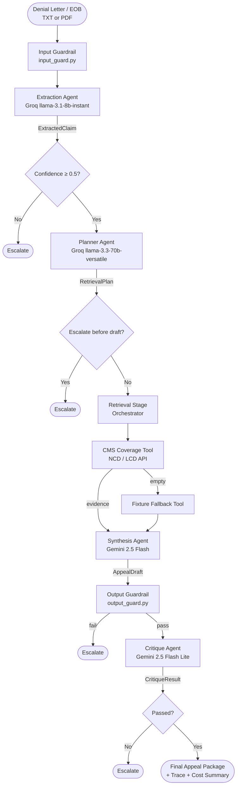

# Claims Denial & Appeal Intelligence Agent

A custom agentic pipeline that transforms an insurance denial letter or EOB document into an evidence-grounded appeal preparation package — with real LLM calls, CMS policy retrieval, self-critique, guardrails, and a web UI.

---

## Domain & Design Rationale

**Domain:** Document Processing — extracting structured data from unstructured medical denial letters and generating evidence-backed appeal arguments.

This domain was chosen because:
- Denial letters are semi-structured but highly variable — ideal for LLM extraction
- CMS coverage policies (NCD/LCD) are authoritative, machine-readable APIs — ideal for grounded retrieval
- Appeals require accurate citation — ideal for testing hallucination guardrails and self-critique

The architecture is a **custom multi-stage agent pipeline** (no external framework dependency), where each stage is a distinct LLM-driven role with its own system prompt, schema, and guardrails.

---

## Architecture



---

## Repo Structure

```
src/agent/
├── agents/          # extraction, planner, synthesis, critique + base
├── api/             # FastAPI app + static HTML frontend
├── cache/           # TTL cache service (in-memory, file-backed, or Redis)
├── core/            # orchestrator, model router, agent state
├── evaluation/      # scenario evaluator
├── guardrails/      # input and output validation
├── llm/             # Groq, AI Studio, Mock providers
├── observability/   # tracer and cost tracker
├── prompts/         # versioned system prompt files (*.md)
├── schemas/         # Pydantic I/O models
├── tools/           # CMS coverage tool, fixture fallback, registry
└── utils/           # PDF text extractor
config/              # models.yaml (provider/model per role), settings.example.yaml
tests/
├── fixtures/        # denial letters (txt + pdf), policy fixtures, scenarios.json
├── unit/            # unit tests
└── integration/     # CMS integration tests
traces/              # sample run artifact (sample_run.json)
```

---

## Setup

```bash
# 1. Clone and enter the repo
git clone https://github.com/scatterbrain-akash/ensemble.git
cd ensemble

# 2. One-command setup (creates .venv, installs deps, copies config)
./run.sh setup

# 3. Activate the environment
source .venv/bin/activate

# 4. Add your API keys to .env
#    GROQ_API_KEY=...
#    AI_STUDIO_API_KEY=...
#    (the pipeline runs with MockProvider if no keys are set)
```

Config files:

| File | Purpose |
|---|---|
| `.env` | API keys (copied from `.env.example`) |
| `config/settings.yaml` | Timeouts, retries, cache TTLs, cost rates |
| `config/models.yaml` | Which LLM model to use per agent role |

---

## Running

```bash
# Process a text denial letter
./run.sh run-txt

# Process the sample PDF denial letter
./run.sh run-pdf

# Process any file (text or PDF)
./run.sh run-custom /path/to/your_eob.pdf

# Or use the CLI directly
python -m src.agent.cli --input tests/fixtures/denial_letters/basic_denial.txt
python -m src.agent.cli --input tests/fixtures/denial_letters/sample_eob_denial.pdf --output result.json
```

---

## Web UI

```bash
./run.sh run-web
# Open http://localhost:8000
```

The UI accepts text paste or PDF drag-and-drop, runs the full pipeline, and shows the appeal package plus a per-stage execution trace table.

---

## Docker

```bash
./run.sh docker-up    # build + start (docker-compose)
./run.sh docker-down  # stop
./run.sh docker-run   # one-shot without compose
```

---

## Tests & Evaluation

```bash
./run.sh test       # full pytest suite
./run.sh evaluate   # scenario evaluator against tests/fixtures/scenarios.json
```

Sample run artifact: `traces/sample_run.json`

```bash
python -m json.tool traces/sample_run.json | less
```

---

## Agent Design Highlights

| Concern | Implementation |
|---|---|
| Multi-stage agents | Custom pipeline: extraction → planning → retrieval → synthesis → critique |
| Prompt engineering | Versioned system prompts with explicit JSON schemas and one-shot examples |
| Structured output | Pydantic models for every stage |
| Self-critique | Dedicated `CritiqueAgent` validates draft against evidence |
| RAG | CMS Coverage API (NCD/LCD) provides grounded policy evidence |
| Guardrails | Input domain check + output hallucination/placeholder detection |
| Observability | Per-stage tracer spans + cost tracker in `metadata` |
| Provider fallback | `ModelRouter` tries primary then fallback providers on HTTP errors |
| PDF support | `pypdf` text extraction for text-layer EOB PDFs |
| Escalation | Explicit early-exit at each stage with `escalation_reason` |

See `ARCHITECTURE.md` for the full design write-up, sample trace, and evaluation results.


## What it does

- Extracts structured claim data from unstructured denial letters
- Retrieves matched CMS coverage policy evidence
- Synthesizes a draft appeal package with explicit citations
- Applies bounded self-critique and guardrails
- Escalates safely when evidence or confidence is insufficient

## CMS Integration

- The project wraps the CMS Coverage API (`https://api.coverage.cms.gov`) in a single tool: `src/agent/tools/cms_coverage.py`.
- Endpoints used: `/v1/data/ncd/`, `/v1/data/lcd/`, `/v1/data/article/` (mapped to `ncdid`, `lcdid`, `articleid` query params).
- LCD/Article calls require a license-agreement token obtained from `/v1/metadata/license-agreement`. The token is valid for ~1 hour and must be provided as `Authorization: Bearer <token>`.
- The tool implements configurable retry/backoff with jitter for transient errors. Configure via `config/settings.yaml` under `retries.cms_tool` (attempts) and `cms.retry_backoff_seconds` / `cms.max_backoff_seconds`.

## Repo structure

- `src/agent/`: application code
- `config/`: runtime settings and model routing
- `tests/`: unit and integration tests
- `tests/fixtures/`: synthetic denial letters and policy fixtures
- `traces/`: sample run and trace artifacts
- `docs/`: architecture and report artifacts

## Setup

1. Create a Python environment:
   ```bash
   python -m venv .venv
   source .venv/bin/activate
   pip install -r requirements.txt
   ```
2. Create `.env` from `.env.example` and set your API keys.

### Configuration

- Copy `config/settings.example.yaml` to `config/settings.yaml` and adjust values for your environment (Redis URL, per-token costs, TTLs, API keys).

CI / Badge

- A GitHub Actions workflow `CI` is provided at `.github/workflows/ci.yml` that runs tests and includes a Redis service for integration tests.
- Add a workflow badge to this README by replacing `OWNER` and `REPO` with your repository owner/name:

   

   Example: ``

### Configuration

- `config/settings.yaml` can be used to tune timeouts, retry/backoff, and CMS-specific settings. Example keys:
   - `timeouts.tool_call_seconds`
   - `retries.cms_tool`
   - `cms.retry_backoff_seconds`
   - `cms.max_backoff_seconds`
   - `cms.license_token_ttl_seconds`

## Run

```bash
python -m src.agent.cli --input "path/to/denial.txt"
```

## Observability

The agent emits structured runtime information in two places:

- `metadata.trace` on the final response contains per-stage spans with `name`, `start_time`, `end_time`, `duration`, and optional metadata.
- `metadata.execution_summary` includes per-step `llm_calls`, `cache_hits`, `tokens_in`, `tokens_out`, `cost_usd`, and result statuses.

A sample execution artifact is available at `traces/sample_run.json`.

To view it:

```bash
python -m json.tool traces/sample_run.json | less
```

or open it in a JSON viewer to inspect the trace spans and summary.

## Developer Quick Commands

Run tests:
```bash
python -m pytest -q
```

Run the scenario evaluator:
```bash
python -c "from pathlib import Path; from src.agent.config import Settings; from src.agent.evaluation.evaluator import Evaluator; print(Evaluator(Settings(env='personal')).run_scenarios(Path('tests/fixtures/scenarios.json')))"
```

If tests fail with import errors, install the package in editable mode:
```bash
pip install -e .
```

## Evaluation

A simple scenario evaluator is available using `tests/fixtures/scenarios.json`.

```bash
python -c "from pathlib import Path; from src.agent.config import Settings; from src.agent.evaluation.evaluator import Evaluator; print(Evaluator(Settings(env='personal')).run_scenarios(Path('tests/fixtures/scenarios.json')))"
```

## Test

```bash
pytest
```
