# System Diagrams (v2)

**Companion to `SOLUTION_DESIGN_v2.md` and `CODEBASE_STRUCTURE_v2.md`.** A visual walkthrough of the whole system — context, components, the solution story, data flow, and every important behavior (routing, caching, resilience, guardrails, evaluation, deployment). Each diagram has a one-line **What it shows** and a **How to explain it** cue for interviews.

> All diagrams are Mermaid; they render in the companion `Ensemble_Solution_v2.html` and in any Mermaid-aware Markdown viewer.

---

## 1. System context (who talks to what)

**What it shows:** the system as one box and everything it touches — the analyst, the CMS policy source, the LLM providers, and local storage.

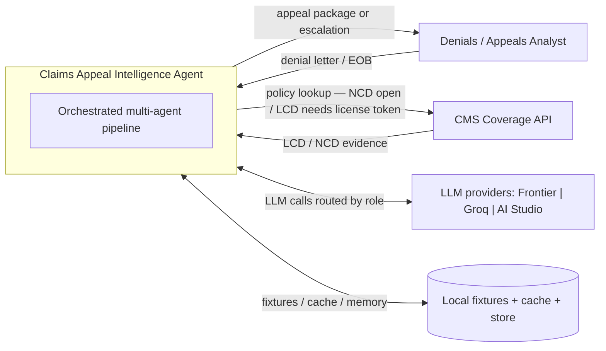

**How to explain it:** "One system, one human, three dependencies. The only mutable external is the CMS API — and I isolated that behind a tool with a fixture fallback, so a network or license-token failure never breaks the demo."

---

## 2. Component / container view (maps 1:1 to the repo)

**What it shows:** the internal modules and how they wire together — this is the codebase structure as a picture.

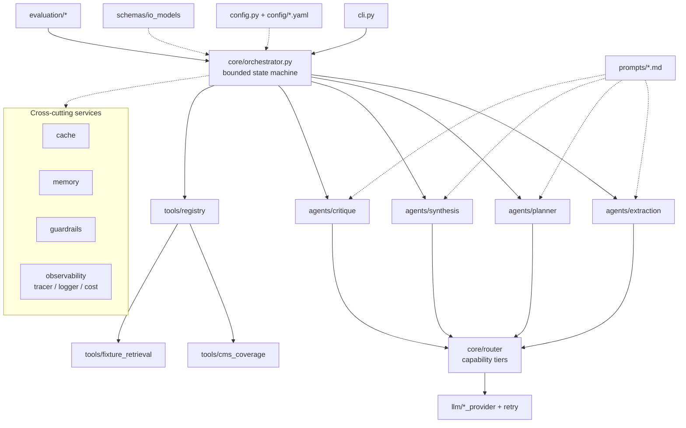

**How to explain it:** "Strict separation of concerns: orchestration owns control flow, agents only reason, tools only do I/O, and routing/caching/observability are cross-cutting. Every arrow is a real dependency — no empty modules."

---

## 3. Solution flow (the story, end-to-end)

**What it shows:** the happy path as a numbered narrative — the single most useful diagram for explaining the product.

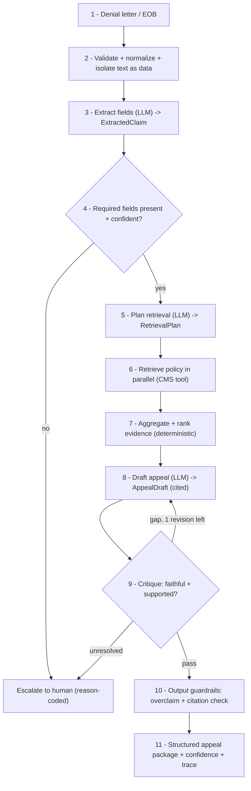

**How to explain it:** "Extract → plan → retrieve → draft → verify → guard. Two exits: a review-ready package, or a reason-coded escalation. The system escalates instead of inventing whenever facts or evidence are missing."

---

## 4. Agent loop as a bounded state machine

**What it shows:** the rubric's reason → plan → act → observe → respond loop, with the guarantee it can't run forever.

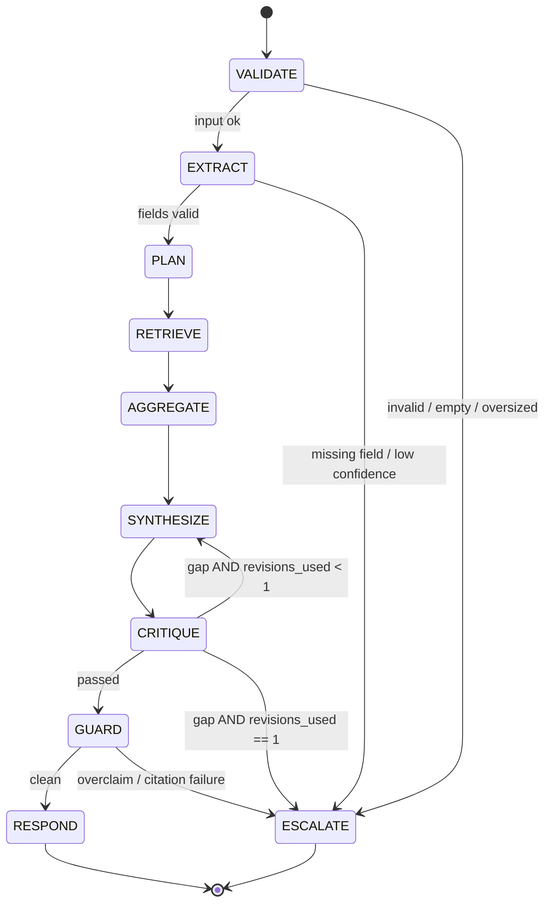

**How to explain it:** "Every transition moves forward except one back-edge — critique → synthesis — bounded to a single revision. A global step ceiling and per-call timeouts are backstops. No infinite loops by construction."

---

## 5. Sequence of one run (with cache + fallback)

**What it shows:** the runtime call order, including a cache check and the CMS → fixture fallback.

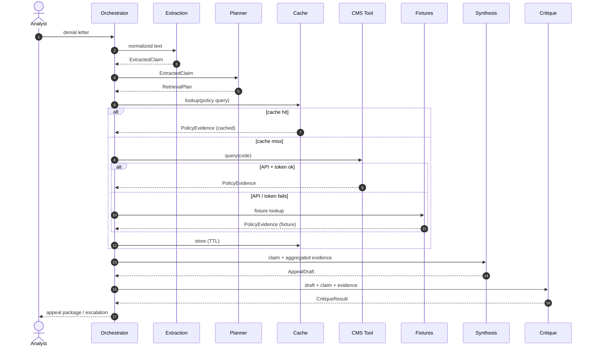

**How to explain it:** "Retrieval is cache-first and failure-tolerant: cache hit → reuse; miss → live CMS; live failure → deterministic fixtures. The trace records which path served each call."

---

## 6. Data flow — typed contracts (what moves between stages)

**What it shows:** the Pydantic contracts and how each one relates to the next. Typed boundaries = observable failures.

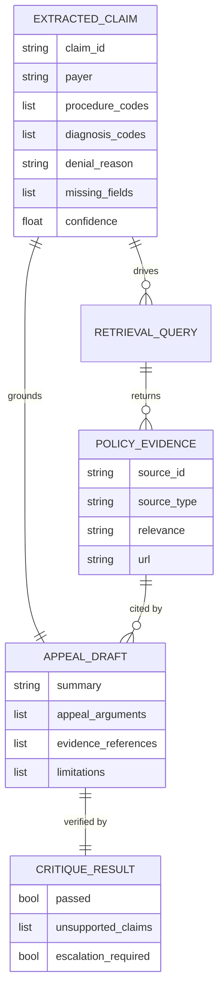

**Contract pipeline (linear view):**

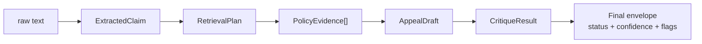

**How to explain it:** "Every handoff is a validated Pydantic object, not free text. If a boundary breaks, the trace shows exactly which contract failed and why."

---

## 7. Purpose-based model routing (dual environment + fallback)

**What it shows:** how one agent role resolves to an actual model — work vs personal laptop — and degrades gracefully.

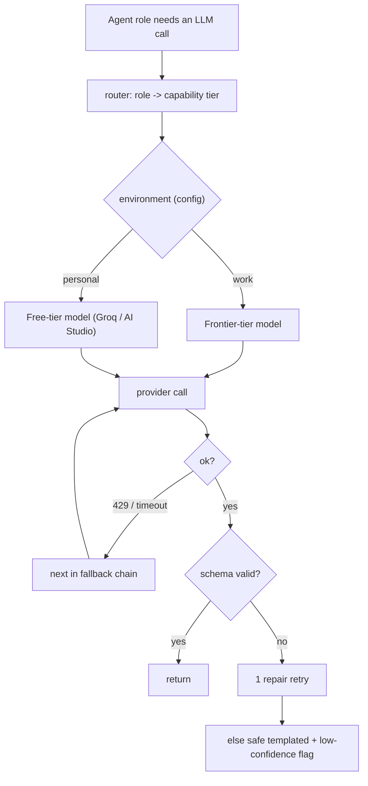

**How to explain it:** "Roles map to capability tiers, not hard model names. Switching my work laptop's frontier models for free-tier open models at home is a one-line config edit — plus a fallback chain and a structured-output degrade ladder."

---

## 8. Caching & memory (why it's reliability, not just cost)

**What it shows:** the cache lookup order and the three memory layers.

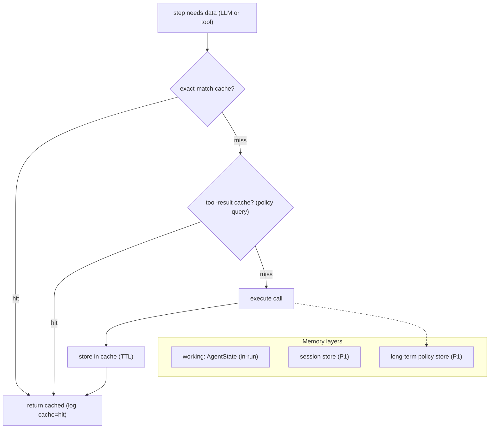

**How to explain it:** "Free-tier daily request caps (RPD) are the binding limit, so caching is what keeps the demo runnable at all — not a nice-to-have. Every cache hit is logged so reviewers can tell fresh calls from reuse."

---

## 9. Error handling & resilience

**What it shows:** the failure ladder — timeout, bounded retry, circuit breaker, fallback, safe terminal.

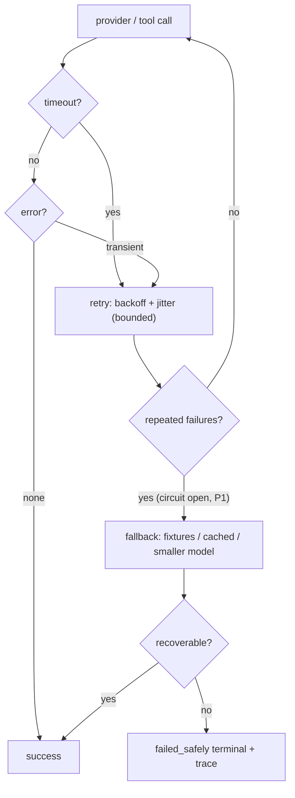

**How to explain it:** "Nothing hangs, nothing loops, nothing crashes silently. Every failure resolves to success, a safe fallback, or a clearly-traced `failed_safely` state."

---

## 10. Guardrails & threat mitigation

**What it shows:** how untrusted input and evidence are contained, and how the output is checked before release.

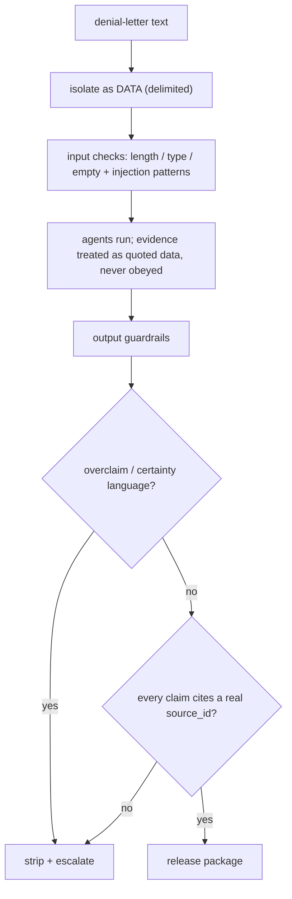

**How to explain it:** "Two trust boundaries: input (the letter) and tool output (retrieved policy) are both treated as data, never instructions. On the way out, I block overconfident claims and unsourced statements — the actual job in a healthcare workflow."

---

## 11. Evaluation flow (measured, not proposed)

**What it shows:** how scenarios turn into a results table, plus the optional judge and golden-trace regression.

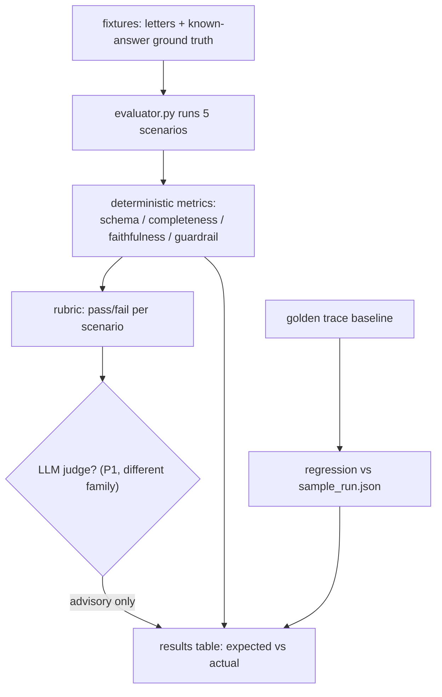

**How to explain it:** "Deterministic checks are authoritative; the LLM judge is advisory and uses a different model family to avoid self-grading bias. Golden traces catch regressions between runs."

---

## 12. Deployment & production roadmap

**What it shows:** what's built now vs the credible path to production (stated, not built — signals forward thinking).

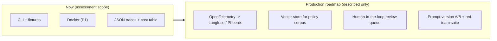

**How to explain it:** "The lightweight tracer is OTel-shaped on purpose, so the jump to Langfuse/Phoenix is a config change, not a rewrite. I named the production path without over-building it into a take-home."

---

## Diagram index (what to show when)

| # | Diagram | Best used to explain |
| --- | --- | --- |
| 1 | System context | scope + dependency isolation |
| 2 | Component view | code organization / separation of concerns |
| 3 | Solution flow | the product story (start here in an interview) |
| 4 | State machine | termination guarantees / the agent loop |
| 5 | Sequence | runtime order, cache + fallback |
| 6 | Data flow / contracts | typed boundaries, structured outputs |
| 7 | Model routing | dual-environment + purpose-based invocation |
| 8 | Caching & memory | cost + reliability under free tiers |
| 9 | Resilience | error awareness / graceful failure |
| 10 | Guardrails | safety / injection / overclaim |
| 11 | Evaluation | measured results + anti-bias judging |
| 12 | Deployment | production maturity / roadmap |

*End of `DIAGRAMS_v2.md`.*
